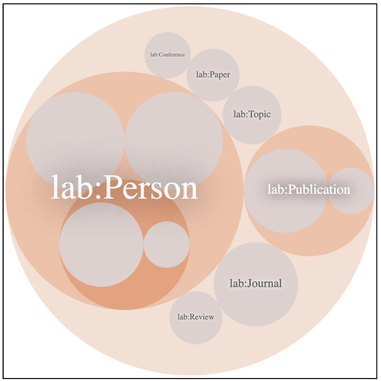
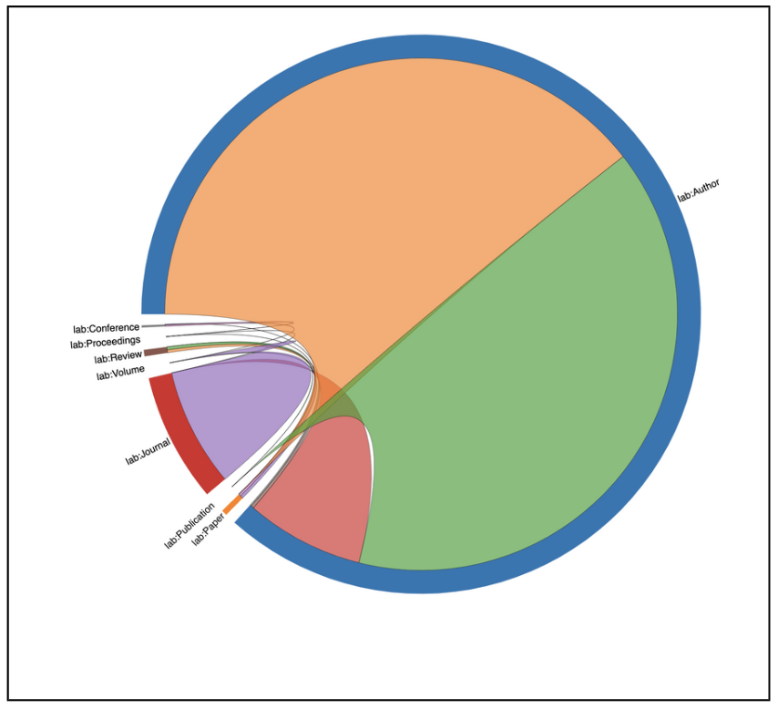

# Semantic Data Management - Knowledge Graph Lab Assignment

This repository contains the implementation of a Knowledge Graph for academic publication data from Tsinghua University's computer science field (2018-2023), sourced from the Scopus database. The project demonstrates the construction and querying of a semantic data model using RDF/RDFS technologies.

## Project Overview

The project builds a comprehensive knowledge graph that models the academic publication ecosystem, including authors, papers, conferences, journals, reviews, and their interconnected relationships. The implementation follows semantic web standards using RDF Schema (RDFS) for ontology definition and RDFLib for graph construction and querying.

## Repository Structure

### Core Files
- **`12E_Isakova_Mahmudova_Report.pdf`** - Complete project report with methodology and results
- **`tbox.ttl`** - Terminological Box (TBOX) defining the ontological schema
- **`abox.ttl`** - Assertional Box (ABOX) containing instance data
- **`B3_TBOX_ABOX_Connection.ttl`** - Final combined ontology with inferred relationships

### Implementation Notebooks
- **`B1_TBOXCreation.ipynb`** - TBOX creation with class and property definitions
- **`B2_ABOXCreation.ipynb`** - ABOX population from CSV data
- **`preprocessing-sdm-lab2.ipynb`** - Data preprocessing and cleaning pipeline

### Data & Results
- **`data/`** - Directory containing processed CSV files with academic publication data
- **`queries_result/`** - Directory with SPARQL query results and outputs
- **`.ipynb_checkpoints/`** - Jupyter notebook checkpoints
- **`.DS_Store`** - System file (macOS)

### Query Files
- **`B3_statisticsQueries.txt`** - Statistical queries for ontology analysis
- **`B4_Queries.txt`** - Complex SPARQL queries for data retrieval

### Visualizations

### TBOX Schema

### Class Hierarchy

### Class Relationships

- **`B1_TBOXCreation_VisualRepresentation.png`** - Visual schema representation
- **`B1_TBOX_GraphDB_ClassHierarchy.png`** - Class hierarchy visualization
- **`B1_TBOX_GraphDB_ClassRelationships.png`** - Class relationship diagram

## Key Features

### Ontological Model
- **Classes**: Person, Author, Paper, Publication, Conference, Journal, Topic, Review, etc.
- **Properties**: writes, publishedAs, reviewedBy, relatedTo, isIn, isOf
- **Hierarchical Structure**: Supports inheritance and complex relationships

### Data Statistics
- **Total Statements**: 57,785,594 (28,766,866 explicit + 29,018,728 inferred)
- **Authors**: 105,871 instances
- **Papers**: 500 instances  
- **Publications**: 20,729 instances
- **Topics**: 487 instances

### Query Capabilities
- Author publication analysis
- Conference and journal statistics
- Topic-based paper classification
- Citation and review networks
- Publication venue analysis

## Technical Implementation

- **Language**: Python with RDFLib
- **Schema**: RDF Schema (RDFS) with RDFS-Plus entailment
- **Query Language**: SPARQL
- **Inference**: Automatic relationship derivation through RDFS reasoning

## Usage

1. **Data Preprocessing**: Run `preprocessing-sdm-lab2.ipynb` to clean and prepare raw data
2. **TBOX Creation**: Execute `B1_TBOXCreation.ipynb` to define the ontological schema
3. **ABOX Population**: Run `B2_ABOXCreation.ipynb` to populate the graph with instances
4. **Query Execution**: Use the provided SPARQL queries in `B4_Queries.txt` for data analysis

## Sample Queries

- Find all papers by a specific author in database conferences
- Calculate average paper length by journal
- Identify most prolific conferences by publication count
- Retrieve properties by domain (Author, Conference, Journal)

## Authors

- **Dilbar Isakova** - dilbar.isakova@student-cs.fr
- **Narmina Mahmudova** - narmina.mahmudova@estudiantat.upc.edu

## Course Information

**Course**: Semantic Data Management  
**Institution**: Facultat d'Informàtica de Barcelona, UPC  
**Instructors**: Anna Queralt, Oscar Romero  
**Date**: May 29, 2024

## License

This project is for academic purposes as part of the Semantic Data Management course curriculum.
